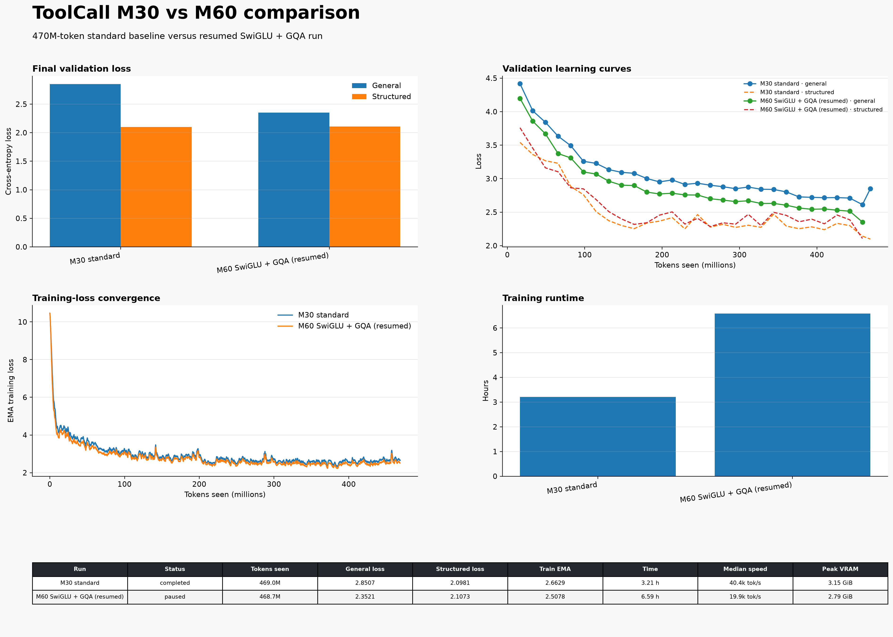

# ToolCall M30 vs M60 results

| Run                        | Status    | Tokens seen   |   General loss |   Structured loss |   Train EMA | Time   | Median speed   | Peak VRAM   |
|:---------------------------|:----------|:--------------|---------------:|------------------:|------------:|:-------|:---------------|:------------|
| M30 standard               | completed | 469.0M        |         2.8507 |            2.0981 |      2.6629 | 3.21 h | 40.4k tok/s    | 3.15 GiB    |
| M60 SwiGLU + GQA (resumed) | paused    | 468.7M        |         2.3521 |            2.1073 |      2.5078 | 6.59 h | 19.9k tok/s    | 2.79 GiB    |
