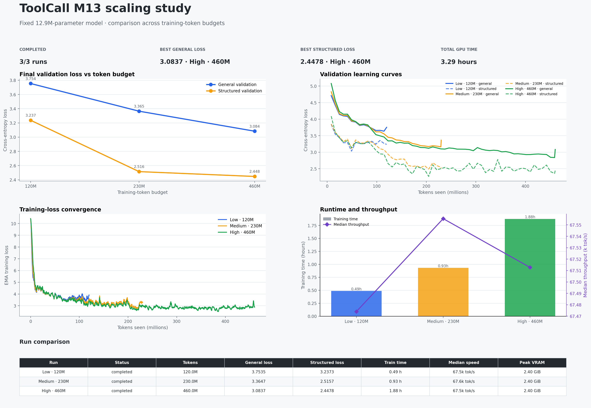

# ToolCall M13 scaling results

## Results table

| Run | Status | Tokens | General loss | Structured loss | Train time | Median speed | Peak VRAM |
| --- | --- | --- | --- | --- | --- | --- | --- |
| Low · 120M | completed | 120.0M | 3.7535 | 3.2373 | 0.49 h | 67.5k tok/s | 2.40 GiB |
| Medium · 230M | completed | 230.0M | 3.3647 | 2.5157 | 0.93 h | 67.6k tok/s | 2.40 GiB |
| High · 460M | completed | 460.0M | 3.0837 | 2.4478 | 1.88 h | 67.5k tok/s | 2.40 GiB |

## Scope

These runs hold model size fixed at approximately 12.9M parameters and vary
the training-token budget. They establish the M13 data-scaling curve; fitting
the full compute-optimal scaling law requires the M30 and M60 run families.
