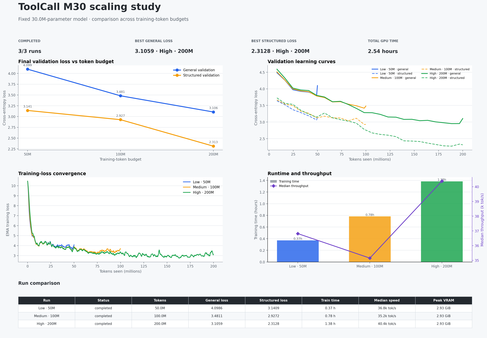

# ToolCall M30 scaling results

## Results table

| Run | Status | Tokens | General loss | Structured loss | Train time | Median speed | Peak VRAM |
| --- | --- | --- | --- | --- | --- | --- | --- |
| Low · 50M | completed | 50.0M | 4.0986 | 3.1409 | 0.37 h | 36.8k tok/s | 2.93 GiB |
| Medium · 100M | completed | 100.0M | 3.4811 | 2.9272 | 0.78 h | 35.2k tok/s | 2.93 GiB |
| High · 200M | completed | 200.0M | 3.1059 | 2.3128 | 1.38 h | 40.4k tok/s | 2.93 GiB |

## Scope

These runs hold model size fixed at approximately 30M parameters and vary
the training-token budget. They establish the M30 data-scaling curve; fitting
the full compute-optimal scaling law requires comparison with the M13 and M60 run families.
