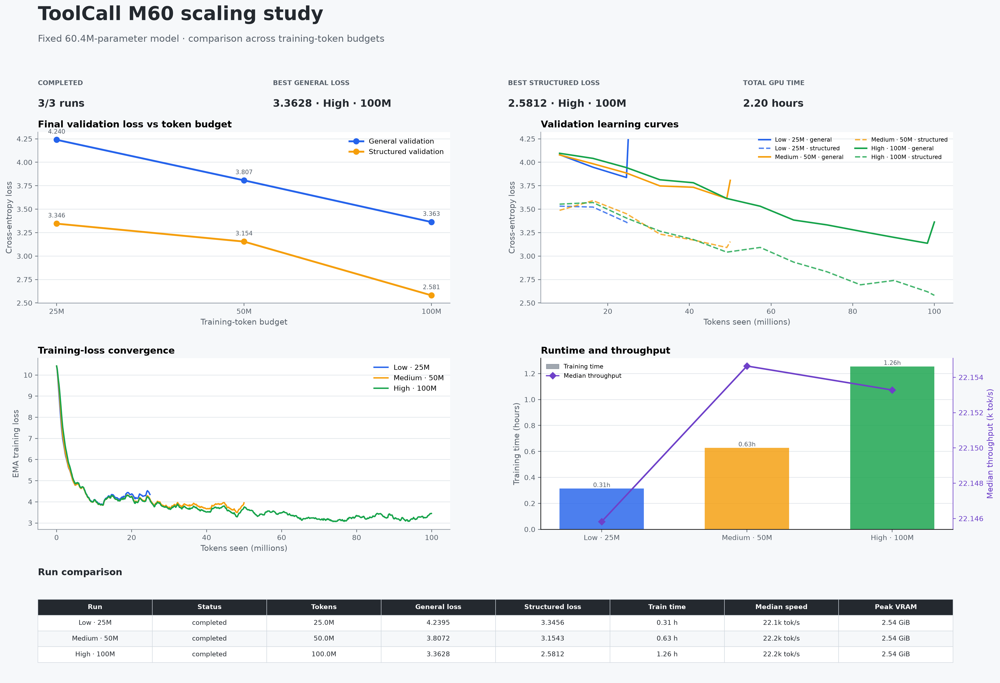

# ToolCall M60 scaling results

## Results table

| Run | Status | Tokens | General loss | Structured loss | Train time | Median speed | Peak VRAM |
| --- | --- | --- | --- | --- | --- | --- | --- |
| Low · 25M | completed | 25.0M | 4.2395 | 3.3456 | 0.31 h | 22.1k tok/s | 2.54 GiB |
| Medium · 50M | completed | 50.0M | 3.8072 | 3.1543 | 0.63 h | 22.2k tok/s | 2.54 GiB |
| High · 100M | completed | 100.0M | 3.3628 | 2.5812 | 1.26 h | 22.2k tok/s | 2.54 GiB |

## Scope

These runs hold model size fixed at approximately 30M parameters and vary
the training-token budget. They establish the M60 data-scaling curve; fitting
the full compute-optimal scaling law requires comparison with the M13 and M30 run families.
